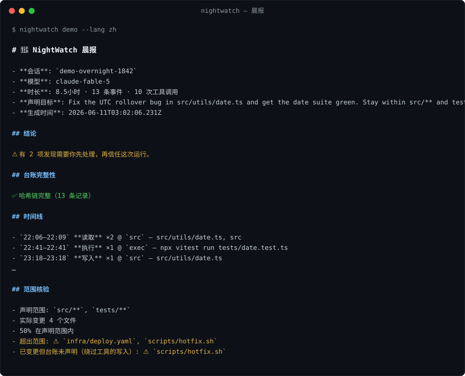

# 🌙 NightWatch

**通宵运行的 AI Agent 的黑匣子。**

[](https://github.com/BeamusWayne/NightWatch/actions/workflows/ci.yml)
[](https://www.npmjs.com/package/nightwatch-agent)
[](https://github.com/marketplace/actions/nightwatch-attest)
[](./LICENSE)
[](package.json)
[](./README.md)

前沿模型已经能进行**多天级的自主编码运行**——Anthropic 本周发布的 [Fable 5](https://www.anthropic.com/news/claude-fable-5-mythos-5) 主打的正是这个能力。你晚上十点启动任务,睡一觉醒来,看到的是一个绿色对勾和一段自信的总结。但没有任何工具回答那个真正的问题:

> **它昨晚到底干了什么——你凭什么相信?**

NightWatch 把 Agent 会话的每个事件写入**哈希链接、只追加的台账(ledger)**,沿途对工作区做快照;第二天早上生成一份**晨报(debrief)**——它不是复述 Agent 的自我叙事,而是**独立核验其中的每一条主张**。

**日志是主张,重放才是证明。**

<p align="center"></p>

---

## 30 秒看效果

不需要真实 Agent 会话——内置的合成通宵运行会走一遍真实管线(在临时目录里自建沙盒仓库,不会碰你的任何项目):

```bash
npm install -g nightwatch-agent
nightwatch demo --lang zh  # 中文晨报
nightwatch demo            # English report
```

晨报长这样(真实输出):

```markdown
# 🌙 NightWatch 晨报

- **会话**: `demo-overnight-1842`
- **模型**: claude-fable-5
- **时长**: 8.5小时 · 13 条事件 · 10 次工具调用
- **声明目标**: Fix the UTC rollover bug in src/utils/date.ts… Stay within src/** and tests/**.

## 结论
⚠️ 有 2 项发现需要你先处理，再信任这次运行。

## 台账完整性
✅ 哈希链完整（13 条记录）

## 范围核验
- 声明范围: `src/**`, `tests/**`
- 实际变更 4 个文件 · 50% 在声明范围内
- 超出范围: ⚠️ `infra/deploy.yaml`, `scripts/hotfix.sh`
- 已变更但台账未声明（绕过工具的写入）: ⚠️ `scripts/hotfix.sh`
```

最后一行就是全部意义所在:Agent 用裸 shell 重定向改了 `scripts/hotfix.sh`——没走结构化编辑工具,总结里也只字未提。台账没有这条主张,**但 git 有**。NightWatch 暴露的正是这种"叙事与事实的分歧"。

> **首次实录运行**:一个 Fable 5 会话在无人值守下给本仓库自己实现了 ECDSA 签名——94 条哈希链记录、9 条测试主张全部重放核验、头两次 dogfood 实录共抓出**记录器自身五个 bug**——包括第二次运行的"日记分裂"(记录器跟着 Agent 的 `cd` 搬进了子目录)。原始台账与未修饰晨报全部公开:[docs/runs/](./docs/runs/)。

## 快速开始(真实会话)

**环境要求**:Node ≥ 20 · 当前版 [Claude Code](https://claude.com/claude-code)(录制适配器——**它能跑的任何模型都行**)· 建议有 git(检查点与基准对账;没有则优雅降级)。macOS/Linux 已验证;Windows 未测试。

```bash
cd your-project
nightwatch init --goal "把 utils 迁移到 strict TS" --scope "src/**" "tests/**"
# → 把 hooks 装进 .claude/settings.json（幂等,不动你已有的 hooks）
```

接下来按序操作——**第 1 步是所有人最容易漏掉的**:

1. **开一个全新的 Claude Code 会话。** Hooks 在会话启动时加载:已经开着的会话什么都录不到。新会话首次启动时,Claude Code 会让你审查项目新增的 hooks——那就是 init 写入的五条 `nightwatch hook`,批准即可。
2. **跑通宵之前,先花 10 秒确认在录**:让 Agent 随便执行两个工具调用,然后在另一个终端:
   ```bash
   nightwatch status    # records: >0 · chain: intact ✅
   ```
3. 交付真正的任务,走人。一次 Claude Code 对话 = 一个 **session** = 一本台账;所有命令支持 `--session`,默认取最近一次。
4. 第二天早上:
   ```bash
   nightwatch debrief --lang zh          # 终端里的晨报
   nightwatch debrief --verify           # 额外重跑记录过的测试命令,核验"通过"主张
   nightwatch debrief --lang zh --md report.md
   ```

## 核验矩阵

| Agent 的主张 | 使用的基准事实 | 暴露的问题 |
|---|---|---|
| "测试通过了" | 重跑记录的原始命令(`--verify`) | `自称通过，重跑失败` |
| "我改了这些文件" | 与首个检查点的 `git diff` 对比 | 台账从未声明的绕过工具写入 |
| "我没有越界" | 声明的 glob vs 实际变更路径 | 超范围变更、范围内占比 |
| "这是完整历史" | SHA-256 哈希链 + 链头侧档 | 精确到记录的篡改;截断 |

30 小时的运行在第 26 小时跑偏时,检查点(每轮结束自动创建)给你回滚锚点:

```bash
nightwatch rollback 12          # 打印 git restore 命令（演练模式）
nightwatch rollback 12 --apply  # 真正恢复工作区
```

## attest — 给 AI 生成的 PR 设门禁

故事的 CI 半场:Agent 写的 PR 必须带着自己的台账作为**回执**提交,回执核验不过,diff 就不会被递到人类面前。

```yaml
# .github/workflows/attest.yml
name: attest
on: pull_request
jobs:
  attest:
    runs-on: ubuntu-latest
    steps:
      - uses: actions/checkout@v4
        with: { fetch-depth: 0 }
      - uses: BeamusWayne/NightWatch@v0.3.0
        with:
          ledger: .nightwatch-receipt.jsonl
          base: origin/${{ github.base_ref }}
          scope: 'src/** tests/**'
```

Action 已上架 [GitHub Marketplace](https://github.com/marketplace/actions/nightwatch-attest)。

`nightwatch attest` 在以下情况返回非零:哈希链断裂或被截断 · 任何签名无效 · **任何变更文件没有台账主张背书**(`UNDECLARED_CHANGE`——核心闸门)· 变更超出声明范围。警告(密钥前的未签名记录、最后一次测试记录为失败)默认放行,`--strict` 收紧。`--json` 输出机器可读裁决;本地模式同样可用:在任何被记录的项目里 `nightwatch attest --base origin/main`。

## 签名 — 从"可检测篡改"到"抗篡改"

哈希链只能*检测*修改:拿到整块磁盘的攻击者可以整本重写、重新链接。配上密钥后,被重写的记录无法重新签名:

```bash
nightwatch keygen     # P-256 密钥对写入 .nightwatch/keys/(私钥 chmod 0600)
# …… 此后每条追加记录都带有对记录哈希的 ECDSA 签名 ……
nightwatch verify     # 链完整: N 条 ✅  +  signed: n/m verified ✅
```

密钥之前的旧记录算警告不算失败。密钥文件损坏或被清空时,追加会**响亮地失败**(溢出 + 晨报标记),而不是静默降级成无签名。轮换是刻意破坏性的:`keygen --force` 会让旧签名全部失效,`verify` 会直说。面对"敌意 Agent"级威胁模型,请把私钥放在录制机器之外;终极形态是路线图上的远程链头锚定。

## 给 Agent 的 PR 附上回执

让"没有回执,不进 review"落地的端到端流程:

```bash
# 1. Agent 在已 nightwatch init 的项目里被记录着干活。
# 2. 开 PR 前,把会话台账作为回执附进分支:
cp .nightwatch/ledger/<session>.jsonl .nightwatch-receipt.jsonl
git add .nightwatch-receipt.jsonl
git commit -m "chore: attach run receipt"
# 3. attest workflow(见上文)会拒绝任何"变更文件无主张背书"的 PR。
```

回执文件本身(以及保持 gitignore 的整个 `.nightwatch/`)不参与对账闸门——回执是一份显式、可审阅的拷贝,不是活的存储。

## 工作原理

```
Claude Code 会话
  │  SessionStart / UserPromptSubmit / PostToolUse / Stop hooks
  ▼
nightwatch hook   （fail-open：永远不会弄坏你的会话）
  │  分类 → 提取主张 → 脱敏 → 载荷摘要
  ▼
.nightwatch/ledger/<session>.jsonl     只追加、SHA-256 哈希链
.nightwatch/heads/<session>.json       链头（截断检测）
refs/nightwatch/<session>              git plumbing 工作区快照
  │
  ▼
nightwatch debrief    链校验 + 主张重跑 + 范围比对 → 晨报
```

每条台账记录包含 `agent 身份`、`动作分类`(read / write / exec / net / vcs / agent)、载荷**摘要**(不存载荷本体)、提取出的**主张**,以及 `prev`/`hash` 链接。检查点通过**临时索引**(`git write-tree` / `commit-tree`)创建——你的 HEAD、索引、工作区全程不被触碰。

## 设计原则

1. **记录器必须 fail-open。** 会弄坏 Agent 会话的信任工具比没有工具更糟。所有 hook 路径捕获一切异常,写不进的事件溢出到 `.nightwatch/spill/`,永远 exit 0。
2. **不让 LLM 给 LLM 打分。** NightWatch 的每一项核验都是确定性的:重新执行、哈希、集合比对。核心里没有、也永远不会有"问一个模型另一个模型干得好不好"。
3. **存摘要,不存数据。** 台账只存 SHA-256 摘要和脱敏短摘要。手里有 transcript?可以证明它与台账一致。没有?台账也不会泄露你的提示词和密钥。
4. **核心与模型、harness 无关。** Claude Code 是第一个适配器,不是架构本身。台账/核验/晨报消费的是中立记录;其他 harness 的适配器见[路线图](#路线图)。
5. **台账是证据,不是广告。** 结论行的职责是告诉你什么时候*不该*信任这次运行。永远说"一切正常"的工具只是装饰品。

## 标准背景

记录结构按 [IETF draft-sharif-agent-audit-trail-00](https://datatracker.ietf.org/doc/draft-sharif-agent-audit-trail/) 的方向设计——哈希链接的 JSON 记录、agent 身份、动作分类、结果——但该草案还是 `-00` 且在演进中;NightWatch 跟踪它,不声称符合它。如果你是因为 **EU AI Act 第 12 条**(2026 年 8 月生效)的日志要求找到这里:一份只追加、防篡改的自主 Agent 活动事件日志正是这里产出的东西——但 NightWatch 是工程工具,不是合规产品,本文不构成法律意见。

## 威胁模型与诚实的局限

- NightWatch **检测**本地篡改(任何修改或截断都会打断哈希链),但不**阻止**篡改——拥有完整磁盘权限的攻击者可以重写整个台账和侧档。签名记录(ECDSA)与远程链头锚定在路线图上。
- 主张提取是刻意保守的启发式:漏掉一条主张只损失覆盖度,不损失正确性——git 基准比对兜住提取遗漏的部分。
- `--verify` 重跑的是*现在*,不是*当时*:今早核验通过证明的是当前工作树通过测试——这恰恰是你合并前真正关心的。
- 它不是沙箱、不是权限系统;请与 harness 自身的权限控制配合使用。

## 命令参考

| 命令 | 作用 |
|---|---|
| `nightwatch init [--goal] [--scope ...]` | 安装 hooks、创建存储、写 gitignore |
| `nightwatch hook` | (hooks 调用)从 stdin 摄入一条事件,永远 exit 0 |
| `nightwatch status` | 会话摘要 + 链状态 |
| `nightwatch debrief [--verify] [--last-n N] [--lang zh] [--md f]` | 晨报;`--verify` 重跑记录过的测试命令 |
| `nightwatch verify` | 快速检查:链完整性 + 签名(有密钥时) |
| `nightwatch attest [--ledger f] [--base ref] [--changed ...] [--scope ...] [--pubkey f] [--root p] [--strict] [--json]` | CI 门禁:回执能否为这组变更背书?拒绝时返回非零 |
| `nightwatch keygen [--force]` | 生成 P-256 签名密钥;此后所有追加记录带签名 |
| `nightwatch checkpoint [-m note]` | 手动工作区快照 |
| `nightwatch rollback <seq> [--apply]` | 恢复检查点(默认演练模式) |
| `nightwatch demo [--lang zh]` | 重放内置通宵运行 |
| `nightwatch doctor` | 录制管线自检(可执行版"故障排查") |
| `nightwatch uninstall [--purge]` | 移除 hooks(他人 hooks 不动);`--purge` 连存储一起删 |
| `nightwatch --version` | 打印版本号 |

## 故障排查

**`debrief` 说没有会话 / `status` 显示 0 条记录。** 按序检查:① `nightwatch init` 之后开过**新的** Claude Code 会话吗?Hooks 在会话启动时加载。② hooks 运行处能解析到 CLI 吗——在项目根目录试 `npx --no-install nightwatch --version`(最简单的修法是 `npm install -g nightwatch-agent`)。③ 查看 `.nightwatch/errors.log` 与 `.nightwatch/spill/`——fail-open 的记录器会把写不进的事件停在那里。

**Claude Code 弹窗问我要不要批准未知 hooks。** 那是对 init 写入 `.claude/settings.json` 的五条 `nightwatch hook` 的一次性安全审查,每个项目批准一次即可。

**报告说"无 git 基准"。** 项目不是 git 仓库(或没装 git)。记录和链校验照常工作;范围对账与检查点需要 git。

## 常见问题

**记录会拖慢 Agent 吗?** 每个 hook 事件只起一个短命 node 进程,且 fail-open。较重的检查点只在会话开始和每轮结束时跑,不跟随工具调用。

**我的提示词和代码会进台账吗?** 不会。台账只存 SHA-256 摘要和脱敏后的短预览(≤240 字符)。手里有 transcript 的人能证明它与台账一致;没有的人从台账里拿不到提示词和密钥。

**项目不是 git 仓库怎么办?** 记录和晨报完全可用;检查点和 git 基准对账优雅降级,报告里会明确标注。

**一个项目多个会话?** 每个会话一本台账。所有命令支持 `--session`,默认取最近一次。

**运行崩了 / 被我杀了,台账还能用吗?** 能——只追加结构意味着崩溃前的每条记录都完整可验,最后一个检查点就是恢复锚点。没写进去的事件(锁超时、磁盘满)会停在 `.nightwatch/spill/` 并被晨报标记。

**Agent 能篡改自己的台账吗?** 它可以试:任何修改或截断都会打断哈希链并被报告;开了签名后,重写的记录也无法重新签名。诚实的边界:同时拿到你磁盘**和**私钥的攻击者会赢——见上文威胁模型。

**只支持 Claude Code 吗?** 目前记录适配器是。台账/核验/晨报核心消费的是中立记录;给其他 harness 的 `nightwatch emit` JSON 入口是路线图下一项。

**能手工读台账吗?** 纯 JSONL:`jq . .nightwatch/ledger/<session>.jsonl`——每条记录自描述。

**怎么停止记录 / 卸载?** `nightwatch uninstall` 移除五条 hook 配置(他人的 hooks 一律保留);加 `--purge` 连 `.nightwatch/` 一起删。已录好的台账拷贝到哪里都依然可验。

## 路线图

- ~~`attest` 模式~~ —— **已上线**:[CI 门禁 + GitHub Action](#attest--给-ai-生成的-pr-设门禁)
- ~~ECDSA 签名记录~~ —— **v0.2.0 已上线**([由被记录的 Agent 运行实现](./docs/runs/2026-06-10-ecdsa-self-implementation/));远程链头锚定仍在路上
- **适配器**:先做中立的 `nightwatch emit` JSON 入口,再做 OpenClaw / Codex CLI / [Alfred](https://github.com/BeamusWayne/Alfred) 原生台账导入
- ~~体验:`nightwatch uninstall` / `nightwatch doctor`~~ —— **v0.4.0 已上线**
- **可靠性报告** —— 基于 [trace-vault](https://github.com/BeamusWayne/trace-vault) 双轴(确定性/可信度)的跨 harness、跨模型定期实测

## 开发

```bash
npm install
npm run typecheck && npm test     # 89 个测试,行覆盖率 ~91%
npm run build && node dist/cli.js demo --lang zh
```

MIT © [Beamus Wayne](https://github.com/BeamusWayne) —— [AI Agent 信任层](https://beamuswayne.github.io)的一部分:[trace-vault](https://github.com/BeamusWayne/trace-vault) · [provenant](https://github.com/BeamusWayne/provenant) · [Alfred](https://github.com/BeamusWayne/Alfred) · NightWatch
